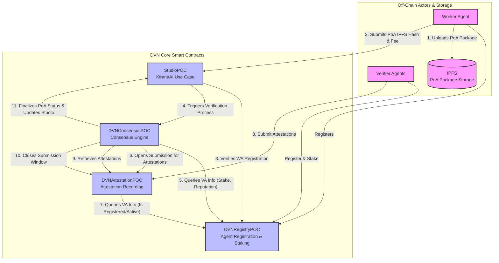

# ChaosChain DVN PoC 

**Decentralized Verification Network Proof-of-Concept for AI Agent Collaboration**

[](https://soliditylang.org/)
[](https://hardhat.org/)
[](https://opensource.org/licenses/MIT)
[](#testing)

---

## 🚀 Overview

ChaosChain DVN PoC demonstrates the first **Decentralized Verification Network** for AI agent collaboration. This system enables Worker Agents to submit verifiable work for evaluation by a network of Verifier Agents, creating immutable **Proof-of-Agency** records on the blockchain.

### 🎯 Key Innovation
Unlike traditional blockchain systems that verify transactions, the DVN verifies the **quality and correctness of AI agent work**, enabling trusted multi-agent collaboration at scale.

---

## 🏗️ Architecture

The DVN consists of several core smart contracts and off-chain components working together:



### Smart Contracts

This PoC is composed of the following core smart contracts deployed on the Sepolia testnet:

| Contract Name       | Description                                     | Sepolia Address                                                                                                              |
|---------------------|-------------------------------------------------|------------------------------------------------------------------------------------------------------------------------------|
| DVNRegistryPOC      | Agent registration and staking management       | [`0x5A6207a7...0aB599fE`](https://sepolia.etherscan.io/address/0x5A6207a71c49037316aD1C37E26df2E40aB599fE)                   |
| StudioPOC           | KiranaAI inventory verification studio          | [`0x03ed96a2...Acac40De`](https://sepolia.etherscan.io/address/0x03ed96a2543deaAfD9537107bFE017e5Acac40De)                   |
| DVNAttestationPOC   | Verifier agent attestation recording            | [`0x950B75d0...BCA5541F`](https://sepolia.etherscan.io/address/0x950B75d0769dfC164f030976cEAd4C89BCA5541F)                   |
| DVNConsensusPOC     | Consensus processing and finalization           | [`0x33807533...Ea0771dDa`](https://sepolia.etherscan.io/address/0x33807533035915AA6A461E4d0c7b136Ea0771dDa)                   |
| IStudioPolicy       | Standard interface for all Studios              | (N/A - Interface Only)                                                                  |


## ✨ Features

### 🤖 Agent Management
- **Worker Agent Registration**: Submit work for verification
- **Verifier Agent Registration**: Evaluate and attest to submissions
- **Reputation System**: Dynamic reputation scoring (100-1000 range)
- **Staking Mechanism**: Economic security through ETH staking

### 🏪 Studio System
- **KiranaAI Integration**: Inventory verification use case
- **Flexible Action Types**: Support for multiple verification scenarios
- **Fee Structure**: 0.0001 ETH verification fees
- **Custom Policies**: Studio-specific verification criteria

### ⚖️ Consensus Engine
- **Configurable Parameters**: 3 minimum attestations, 66% threshold
- **Weighted Voting**: Stake × reputation weighting
- **Timeout Protection**: 10-minute attestation windows
- **Reward Distribution**: Automatic verifier compensation

### 🔒 Security & Trust
- **Proof-of-Agency**: Immutable verification records
- **Anti-Double-Voting**: Prevents duplicate attestations
- **Access Control**: Role-based permissions
- **Slashing Protection**: Economic penalties for misbehavior

---

## 📋 Prerequisites

- **Node.js** v16+ 
- **npm** or **yarn**
- **Git**
- **Ethereum wallet** with Sepolia testnet ETH
- **RPC Provider** (Infura, Alchemy, etc.)

---

## 🚀 Quick Start

### 1. Installation

```bash
# Clone the repository
git clone https://github.com/ChaosChain/chaoschain-dvn.git
cd chaoschain-dvn

# Install dependencies
npm install

# Copy environment template
cp config/environment.example .env
```

### 2. Environment Setup

Edit `.env` with your configuration:

```bash
# Sepolia testnet configuration
SEPOLIA_RPC_URL=https://sepolia.infura.io/v3/YOUR_PROJECT_ID
PRIVATE_KEY=your_private_key_without_0x_prefix
ETHERSCAN_API_KEY=your_etherscan_api_key
```

### 3. Compile & Test

```bash
# Compile contracts
npm run compile

# Run tests
npm test

# Test with gas reporting
REPORT_GAS=true npm test
```

### 4. Deploy

```bash
# Deploy to Sepolia testnet
npm run deploy:sepolia

# Or deploy locally for testing
npm run deploy:local
```

---

## 🧪 Testing

The project includes comprehensive test coverage:

```bash
# Run all tests
npm test

# Run specific test file
npx hardhat test tests/unit/DVNRegistry.test.js

# Generate coverage report
npm run coverage
```

### Test Results
```
✅ 15/15 Tests Passing
✅ Agent Registration & Management
✅ Staking Mechanisms
✅ Work Submission Workflow
✅ Attestation Recording
✅ Access Control & Security
```

---

## 📖 Usage Examples

### Register a Verifier Agent

```javascript
const DVNRegistry = await ethers.getContractFactory("DVNRegistryPOC");
const registry = DVNRegistry.attach(contractAddress);

// Register as verifier
const agentId = ethers.utils.formatBytes32String("verifier-001");
await registry.registerAgent(agentId, 1, "https://my-endpoint.com");

// Stake ETH
await registry.mockStake({ value: ethers.utils.parseEther("0.01") });
```

### Submit Work to Studio

```javascript
const StudioPOC = await ethers.getContractFactory("StudioPOC");
const studio = StudioPOC.attach(studioAddress);

// Submit inventory verification work
const poaId = await studio.submitWork(
  ethers.utils.formatBytes32String("worker-001"),
  "KiranaAI_StockReport",
  "QmIPFSHashOfSubmissionData",
  { value: ethers.utils.parseEther("0.0001") }
);
```

### Submit Attestation

```javascript
const DVNAttestation = await ethers.getContractFactory("DVNAttestationPOC");
const attestation = DVNAttestation.attach(attestationAddress);

// Verifier attests to submission
await attestation.submitAttestation(
  poaId,
  true, // approved
  "QmIPFSHashOfJustification"
);
```

---

## 🏪 KiranaAI Studio Demo

The PoC includes a complete **KiranaAI inventory verification studio** that demonstrates:

- **Worker Agents** submit store inventory reports
- **Verifier Agents** validate inventory accuracy
- **Consensus mechanism** determines verification outcome
- **Proof-of-Agency** records provide audit trail

### Supported Action Types
- `KiranaAI_StockReport` - Daily inventory counts
- `KiranaAI_InventoryAudit` - Comprehensive audits  
- `KiranaAI_ReorderAlert` - Automated reorder triggers

---

## 📊 Contract Specifications

### Economic Parameters
```solidity
MINIMUM_STAKE = 0.001 ether;     // Minimum VA stake
VERIFICATION_FEE = 0.0001 ether; // Studio submission fee
INITIAL_REPUTATION = 100;        // Starting reputation
CONSENSUS_THRESHOLD = 66%;       // Approval threshold
ATTESTATION_TIMEOUT = 10 minutes; // Response window
```

### Gas Optimization
- Optimized for 200 compiler runs
- Efficient storage patterns
- Event-based data retrieval
- Batch operations support

---

## 🛠️ Development

### Project Structure

```
chaoschain-dvn/
├── contracts/           # Smart contracts
│   ├── interfaces/      # Contract interfaces
│   ├── DVNRegistryPOC.sol
│   ├── StudioPOC.sol
│   ├── DVNAttestationPOC.sol
│   └── DVNConsensusPOC.sol
├── scripts/            # Deployment scripts
├── tests/              # Test suite
├── docs/               # Documentation
├── config/             # Configuration files
└── agents/             # Python agents (Phase 2)
```

### Available Scripts

```bash
npm run compile         # Compile contracts
npm test               # Run test suite
npm run deploy:sepolia # Deploy to Sepolia
npm run deploy:local   # Deploy locally
npm run clean          # Clean artifacts
npm run coverage       # Generate coverage
```

---

## 🔮 Roadmap

### Phase 1: Smart Contracts ✅ COMPLETE
- [x] DVN core smart contract system
- [x] KiranaAI Studio implementation
- [x] Comprehensive testing suite
- [x] Sepolia deployment ready

### Phase 2: Agent Automation 🚧 IN PROGRESS
- [ ] Python Worker Agent scripts
- [ ] Python Verifier Agent scripts  
- [ ] IPFS integration for metadata
- [ ] End-to-end demo automation

### Phase 3: Advanced Features 📋 PLANNED
- [ ] Multi-studio support
- [ ] Advanced consensus algorithms
- [ ] ZK-proof integration
- [ ] Cross-chain compatibility

---

## 🤝 Contributing

We welcome contributions! Please see our [Contributing Guidelines](CONTRIBUTING.md) for details.

### Development Setup

1. Fork the repository
2. Create feature branch: `git checkout -b feature/amazing-feature`
3. Make changes and add tests
4. Ensure all tests pass: `npm test`
5. Commit changes: `git commit -m 'Add amazing feature'`
6. Push to branch: `git push origin feature/amazing-feature`
7. Open Pull Request

---

## 📚 Documentation

- [Setup Guide](docs/SETUP.md) - Detailed setup instructions
- [Phase 1 Summary](PHASE_1_COMPLETION_SUMMARY.md) - Development progress
- [Architecture Details](docs/ARCHITECTURE.md) - Technical deep dive
- [API Reference](docs/API.md) - Contract interfaces

---

## 🔐 Security

### Audit Status
- [ ] Internal security review
- [ ] External audit (planned)
- [ ] Bug bounty program (planned)

### Report Security Issues
Please report security vulnerabilities to: security@chaoschain.io

---

## 📄 License

This project is licensed under the MIT License - see the [LICENSE](LICENSE) file for details.

---

## 🌟 Acknowledgments

- **OpenZeppelin** for secure contract libraries
- **Hardhat** for development framework
- **Ethereum Foundation** for blockchain infrastructure
- **IPFS** for decentralized storage

---

## 📞 Support & Community

- **GitHub Issues**: [Report bugs or request features](https://github.com/chaoschain/dvn-poc/issues)
- **Discussions**: [Join community discussions](https://github.com/chaoschain/dvn-poc/discussions)
- **Documentation**: [Read the docs](docs/)
- **X/Twitter**: [@ChaosChain](https://x.com/ch40schain)

---

**Built with ❤️ by the ChaosChain team**

*Creating the future of verifiable AI agent collaboration* 🚀